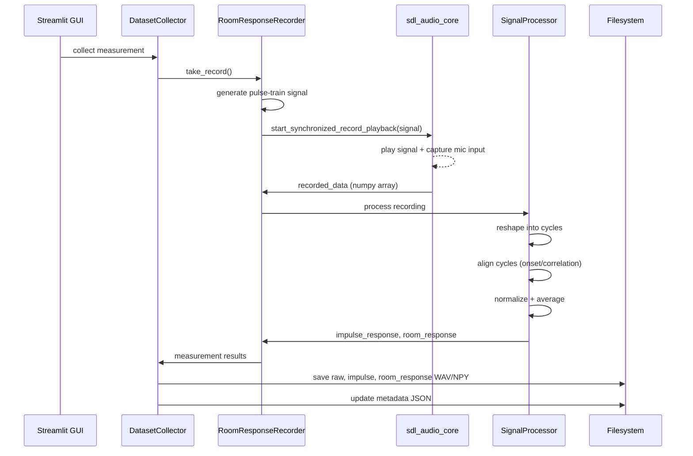
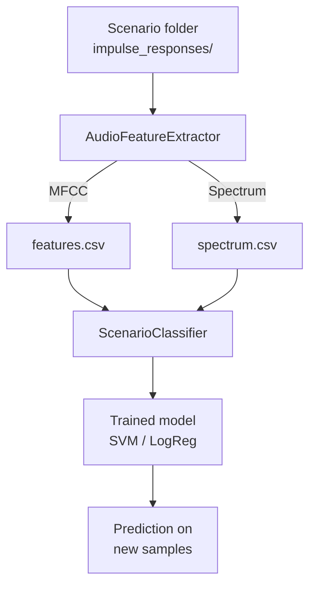
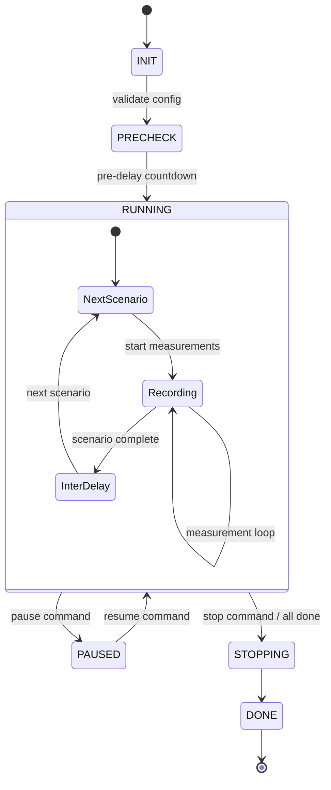

# Data Flows

## 1. Recording Flow

Single measurement from signal generation through storage.



## 2. Signal Processing Pipeline

```
Raw recording (N samples, C channels)
    |
    v
Reshape into cycles (num_pulses x cycle_samples x channels)
    |
    v
Cycle alignment
    ├── Standard mode: cross-correlation alignment
    └── Calibration mode: calibration channel onset detection
    |
    v
Normalization (per-cycle or calibration-based)
    |
    v
Averaging (across valid cycles, skip warm-up)
    |
    v
Truncation (optional, configurable IR length + fade)
    |
    v
Output: impulse_response per channel
```

## 3. Multi-Channel Data Path

For professional audio interfaces (e.g., Behringer UMC1820):

```
sdl_audio_core captures N channels simultaneously
    |
    v
RoomResponseRecorder receives interleaved multi-channel data
    |
    v
SignalProcessor processes each channel independently
    |
    v
Calibration channel (if configured) used for:
    - Onset alignment reference
    - Amplitude normalization
    |
    v
Per-channel impulse responses saved as:
    impulse_<scenario>_IDX_TIMESTAMP_chN.npy
```

Key config fields in `recorderConfig.json`:

| Field | Purpose |
|-------|---------|
| `multichannel_config.enabled` | Enable multi-channel recording |
| `multichannel_config.num_channels` | Total input channels |
| `multichannel_config.calibration_channel` | Channel used for alignment reference |
| `multichannel_config.reference_channel` | Channel used for normalization |
| `multichannel_config.response_channels` | Channels containing response data |

## 4. Feature Extraction Flow



## 5. Series Collection Flow

The `SeriesWorker` runs as a daemon thread for unattended multi-scenario collection.



## 6. ESPRIT Analysis Flow

```
Multi-channel impulse responses (NPY files)
    |
    v
Preprocessing (optional contact removal, windowing)
    |
    v
Build Hankel matrix (single or multi-channel stacked)
    |
    v
SVD (CPU or GPU via CuPy)
    |
    v
Model order estimation (singular value gap)
    |
    v
ESPRIT shift-invariance -> complex poles
    |
    v
Extract: frequencies, damping ratios, mode shapes
    |
    v
Stabilization diagram (optional, multi-order sweep)
```
