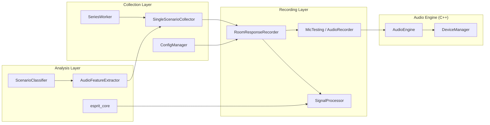

# System Overview

RoomResponse is a 3-layer system: a C++ audio engine, Python backend modules, and a Streamlit GUI.

## Layer Stack

| Layer | Components | Responsibility |
|-------|-----------|----------------|
| **C++ Engine** | `sdl_audio_core` (pybind11) | SDL2 audio I/O, device management, low-latency record/playback |
| **Python Backend** | `RoomResponseRecorder`, `SignalProcessor`, `DatasetCollector`, `FeatureExtractor`, `ScenarioClassifier`, `ESPRIT` | Recording orchestration, signal processing, dataset management, ML |
| **Streamlit GUI** | `gui_launcher.py` + panel modules | User interface, visualization, series collection control |

## Component Relationships

## Threading Model

| Thread | Owner | Purpose |
|--------|-------|---------|
| Main thread | Streamlit | GUI rendering and user interaction |
| SeriesWorker | `gui_series_worker.py` | Background series collection (daemon thread) |
| SDL audio callback | `sdl_audio_core` | Real-time audio capture and playback |

The `SeriesWorker` communicates with the GUI via two `queue.Queue` objects:

- **Command queue** (GUI -> Worker): `start`, `pause`, `resume`, `stop`
- **Event queue** (Worker -> GUI): `status`, `progress`, `error`, `done`, `heartbeat`

## Key Design Decisions

- **SDL2 over PortAudio/PyAudio**: SDL2 provides consistent cross-platform behavior with better multi-channel support.
- **pybind11 bindings**: Zero-copy numpy array interop between C++ audio buffers and Python signal processing.
- **Config-driven recording**: All signal parameters (pulse shape, duration, frequency, channels) come from `recorderConfig.json`.
- **Separated SignalProcessor**: Pure signal processing extracted from `RoomResponseRecorder` for testability. No I/O dependencies.
- **Streamlit GUI**: Rapid prototyping with session state for classifier persistence and dataset caching.
