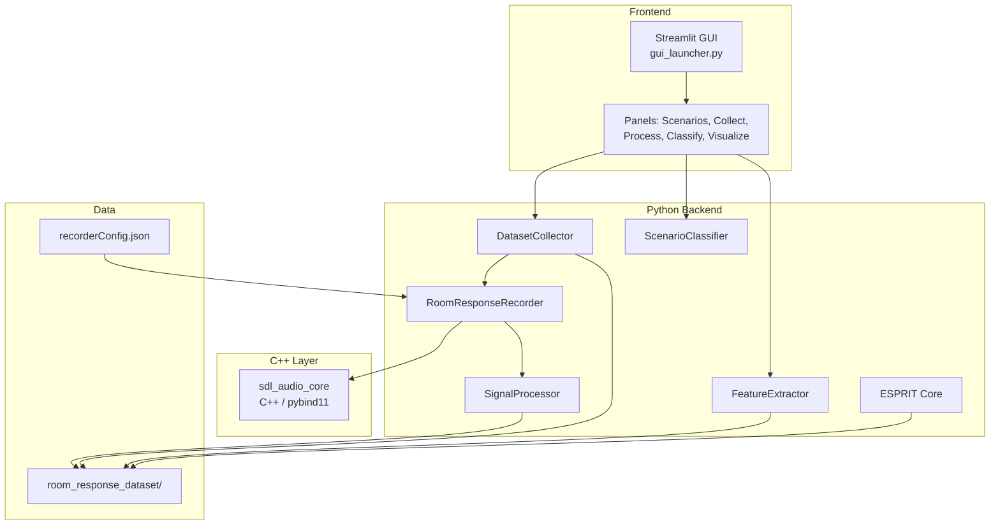

# RoomResponse Documentation

Acoustic room response measurement system. Injects configurable pulse-train signals through a C++ SDL2 audio engine, records multi-channel responses, extracts impulse responses via signal processing, and classifies room acoustics with ML. Includes ESPRIT modal analysis for piano soundboard research.

---

## System Architecture

## Module Index

| Module | Language | Role |
|--------|----------|------|
| `sdl_audio_core` | C++ / pybind11 | Low-latency audio I/O via SDL2 |
| `RoomResponseRecorder` | Python | Recording orchestration, signal generation, playback+capture |
| `SignalProcessor` | Python | Cycle extraction, alignment, normalization, averaging |
| `DatasetCollector` | Python | Scenario-based dataset management, metadata, QA |
| `FeatureExtractor` | Python | MFCC and spectrum feature extraction |
| `ScenarioClassifier` | Python | SVM/LogReg training, evaluation, model persistence |
| `ESPRIT` | Python | TLS-ESPRIT modal identification for piano soundboards |
| `gui_launcher` | Python (Streamlit) | Multi-panel GUI application |

## Documentation Map

### Architecture

- [System Overview](architecture/SYSTEM_OVERVIEW.md) -- components, threading, lifecycle
- [Build System](architecture/BUILD_SYSTEM.md) -- toolchain, dependencies, build commands
- [Data Flows](architecture/DATA_FLOWS.md) -- end-to-end data flow traces

### Modules

- [SDL Audio Core](modules/sdl-audio-core/OVERVIEW.md) -- C++ audio engine with pybind11 bindings
- [Recorder](modules/recorder/OVERVIEW.md) -- recording orchestration and signal generation
- [Signal Processing](modules/signal-processing/OVERVIEW.md) -- cycle extraction, alignment, averaging
- [GUI](modules/gui/OVERVIEW.md) -- Streamlit panels and series worker
- [Dataset & Collection](modules/dataset/OVERVIEW.md) -- scenario management and dataset structure
- [ML Pipeline](modules/ml-pipeline/OVERVIEW.md) -- feature extraction and classification
- [ESPRIT](modules/esprit/OVERVIEW.md) -- modal identification algorithm

### Development

- [Testing](development/TESTING.md) -- test inventory and usage
- [Work in Progress](development/WORK_IN_PROGRESS.md) -- active investigations

### Guides

- [Quick Start](guides/QUICK_START.md) -- prerequisites, setup, first run
- [Configuration](guides/CONFIGURATION.md) -- recorderConfig.json reference
