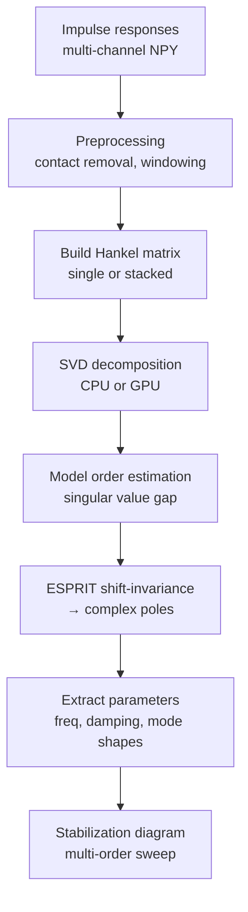

# ESPRIT

TLS-ESPRIT (Total Least Squares - Estimation of Signal Parameters via Rotational Invariance Techniques) implementation for piano soundboard modal analysis.

## Purpose

Extract modal parameters (natural frequencies, damping ratios, mode shapes) from multi-channel impulse response recordings of piano soundboards.

## Directory

```
ESPRIT/
├── esprit_core.py              # Core algorithm
├── esprit.py                   # High-level wrapper / comparison
├── band_processing.py          # Multi-band frequency analysis
├── build_hankel.py             # Hankel matrix construction
├── preprocessing.py            # Signal preprocessing
├── preprocessing_minimal.py    # Minimal preprocessing variant
├── stabilization.py            # Stabilization diagram
├── svd_cpu.py                  # CPU-based SVD
├── svd_gpu.py                  # GPU-based SVD (CuPy)
├── batch_esprit_analysis.py    # Batch analysis over multiple points
├── convert_to_esprit_format.py # Data format conversion
├── compare_*.py                # Comparison scripts
├── test_*.py                   # Test scripts
└── run_svd_profile.py          # SVD profiling
```

## Core Algorithm

`esprit_core.py` implements:

### ModalParameters

```python
@dataclass
class ModalParameters:
    poles: np.ndarray           # Complex poles s_k, shape (K,)
    frequencies: np.ndarray     # Natural frequencies f_k in Hz, shape (K,)
    damping_ratios: np.ndarray  # Damping ratios zeta_k, shape (K,)
    mode_shapes: np.ndarray     # Complex mode shapes, shape (K, n_channels)
    model_order: int            # Model order M used
    singular_values: np.ndarray # From SVD
```

### Key Functions

| Function | Description |
|----------|-------------|
| `build_hankel_matrix(signal, L)` | Construct Hankel matrix from 1D signal |
| `build_multichannel_hankel(signals, L, mode)` | Multi-channel Hankel (stack or interleave) |

### Pipeline



## Multi-Band Analysis

`band_processing.py` splits the frequency range into bands and runs ESPRIT independently per band. Improves resolution for densely-spaced modes.

## SVD Backends

| Backend | File | Requirement |
|---------|------|-------------|
| CPU | `svd_cpu.py` | numpy/scipy |
| GPU | `svd_gpu.py` | CuPy + CUDA |

## Export Utilities

- `export_piano_point_responses.py` -- Export averaged multi-channel impulse responses to text format
- `export_responses_simple.py` -- Simplified export variant
- `run_esprit_piano.py` -- Run ESPRIT analysis on piano response data
- `convert_to_esprit_format.py` -- Convert recordings to ESPRIT input format
