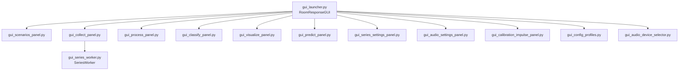

# GUI

Streamlit-based multi-panel application launched via `gui_launcher.py`.

## Entry Point

```bash
streamlit run gui_launcher.py
```

## Panel Architecture



## Panels

| Panel | File | Purpose |
|-------|------|---------|
| Scenarios | `gui_scenarios_panel.py` | Dataset root selection, scenario filtering, inline explorer |
| Collect | `gui_collect_panel.py` | Single and series collection, worker control |
| Process | `gui_process_panel.py` | Feature extraction (MFCC, spectrum) |
| Classify | `gui_classify_panel.py` | Model training, evaluation, confusion matrix |
| Visualize | `gui_visualize_panel.py` | Accuracy matrices, feature importance |
| Predict | `gui_predict_panel.py` | Single-sample inference |

## Supporting Modules

| Module | File | Purpose |
|--------|------|---------|
| Series Settings | `gui_series_settings_panel.py` | Configure series collection parameters |
| Audio Settings | `gui_audio_settings_panel.py` | Audio device and format configuration |
| Calibration | `gui_calibration_impulse_panel.py` | Calibration impulse visualization and validation |
| Config Profiles | `gui_config_profiles.py` | Save/load configuration profiles |
| Device Selector | `gui_audio_device_selector.py` | Audio device selection UI |
| Audio Visualizer | `gui_audio_visualizer.py` | Real-time audio visualization |
| Single Pulse | `gui_single_pulse_recorder.py` | Single pulse recording utility |

## Series Worker

`SeriesWorker` (`gui_series_worker.py`) runs series collection in a daemon thread.

| Feature | Description |
|---------|-------------|
| State machine | INIT -> PRECHECK -> RUNNING -> PAUSED/STOPPING -> DONE |
| Beep notifications | Configurable beeps between scenarios |
| Pause/Resume | Via command queue or sentinel files (`PAUSE`, `STOP`) |
| Watchdog | Timeout detection for stuck recordings |
| Interval modes | `end_to_start` (guarantees cooldown) or `start_to_start` |

## Session State Management

The GUI uses Streamlit session state for persistence across reruns:

| Key | Purpose |
|-----|---------|
| `dataset_root` | Current dataset directory |
| `scenarios_selected_set` | Selected scenario set |
| `classifier_obj` | Persistent ScenarioClassifier instance |
| `scenarios_df_cache` | Cached scenario DataFrame |

## Design Principle

Panels stay thin. Domain logic lives in backend modules (`DatasetCollector`, `ScenarioManager`, `ScenarioClassifier`). Panels handle layout and session state only.
