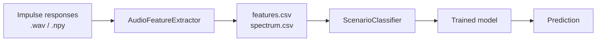

# ML Pipeline

Feature extraction and classification for room acoustic scenario identification.

## Components



## AudioFeatureExtractor

`FeatureExtractor.py` -- processes scenario folders and produces feature CSVs.

### Configuration

| Parameter | Default | Description |
|-----------|---------|-------------|
| `sample_rate` | 16000 | Fallback sample rate |
| `n_mfcc` | 13 | Number of MFCC coefficients |
| `config_filename` | None | JSON config to read `sample_rate` from |
| `max_spectrum_freq` | None | Trim spectrum columns above this frequency |

### Feature Types

| Type | Output File | Columns |
|------|------------|---------|
| MFCC | `features.csv` | `mfcc_0` through `mfcc_12` (default 13) |
| Spectrum | `spectrum.csv` | `freq_0`, `freq_1`, ... (magnitude spectrum bins) |

### Inference API

```python
from FeatureExtractor import AudioFeatureExtractor

ext = AudioFeatureExtractor(sample_rate=48000, n_mfcc=13)
vec = ext.build_feature_vector_from_wav("recording.wav", "mfcc", feature_names)
```

## ScenarioClassifier

`ScenarioClassifier.py` -- train, evaluate, and persist classification models.

### Supported Algorithms

| Algorithm | Class | Notes |
|-----------|-------|-------|
| SVM | `sklearn.svm.SVC` | Default |
| Logistic Regression | `sklearn.linear_model.LogisticRegression` | Alternative |

### Run Modes

| Mode | Method | Description |
|------|--------|-------------|
| Single pair | `run_single_pair()` | Train on two selected scenarios |
| All pairs | `run_all_pairs()` | Evaluate every scenario pair |
| Group vs group | `run_group_vs_group()` | Custom groupings |

### Model Persistence

Models are saved/loaded via `joblib`. Metadata stored with the model includes:

- Dataset root and scenario names
- Feature type and feature names
- Training parameters and timestamps
- Label encoding

### API

```python
from ScenarioClassifier import ScenarioClassifier

clf = ScenarioClassifier()
result = clf.run_single_pair(folder_a, folder_b, feature_type="spectrum")
clf.save_model("model.pkl")
clf.load_model("model.pkl")
prediction = clf.predict(feature_vector)
```
