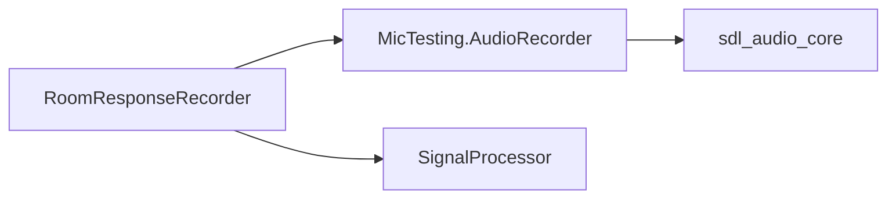

# Recorder

`RoomResponseRecorder` orchestrates room response measurements. It generates pulse-train signals, plays them through the audio engine, captures the response, and delegates signal processing to `SignalProcessor`.

## Entry Point

```python
from RoomResponseRecorder import RoomResponseRecorder

recorder = RoomResponseRecorder(config_file_path="recorderConfig.json")
result = recorder.take_record(output_file, impulse_file, method=2)
```

## Initialization

The constructor loads config from JSON and sets defaults for:

| Parameter | Default | Description |
|-----------|---------|-------------|
| `sample_rate` | 48000 | Audio sample rate (Hz) |
| `pulse_duration` | 0.008 | Pulse width (seconds) |
| `pulse_fade` | 0.0001 | Fade in/out duration (seconds) |
| `cycle_duration` | 0.1 | Full cycle length (seconds) |
| `num_pulses` | 8 | Number of pulses per recording |
| `volume` | 0.4 | Output volume (0-1) |
| `pulse_frequency` | 1000 | Pulse frequency (Hz) |
| `impulse_form` | `sine` | Pulse shape: `sine`, `square`, `voice_coil` |

## Multi-Channel Configuration

Loaded from `multichannel_config` in the JSON config:

| Field | Type | Description |
|-------|------|-------------|
| `enabled` | bool | Enable multi-channel mode |
| `num_channels` | int | Total input channels |
| `calibration_channel` | int/null | Channel for alignment reference |
| `reference_channel` | int | Channel for normalization |
| `response_channels` | list[int] | Channels containing response data |
| `normalize_by_calibration` | bool | Use calibration channel for amplitude normalization |

## Calibration Quality Config

Thresholds for validating impulse response quality (V2 refactored, min/max ranges):

| Parameter | Description |
|-----------|-------------|
| `min/max_negative_peak` | Acceptable range for negative peak amplitude |
| `min/max_positive_peak` | Acceptable range for positive peak amplitude |
| `min/max_aftershock` | Acceptable aftershock amplitude range |
| `min_valid_cycles` | Minimum cycles passing quality check |
| `aftershock_window_ms` | Window for aftershock detection |

## Recording Modes

| Mode | Description |
|------|-------------|
| `standard` | Standard pulse-train recording with cross-correlation alignment |
| `calibration` | Uses calibration channel for onset detection and normalization |

## Dependencies


