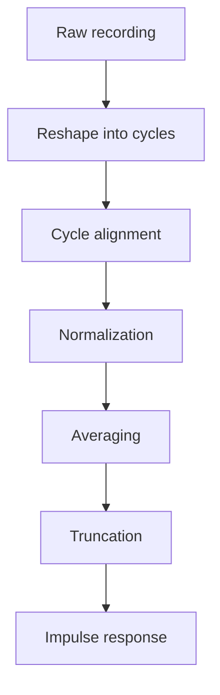

# Signal Processing

`SignalProcessor` handles pure signal processing operations for impulse response measurements. Extracted from `RoomResponseRecorder` for modularity and testability. No hardware or file I/O dependencies.

## Configuration

```python
from signal_processor import SignalProcessor, SignalProcessingConfig

config = SignalProcessingConfig(
    num_pulses=8,
    cycle_samples=4800,
    sample_rate=48000,
    multichannel_config={...}
)
processor = SignalProcessor(config)
```

| Field | Type | Description |
|-------|------|-------------|
| `num_pulses` | int | Number of cycles in recording |
| `cycle_samples` | int | Samples per cycle |
| `sample_rate` | int | Audio sample rate (Hz) |
| `multichannel_config` | dict | Multi-channel settings (optional) |

## Processing Pipeline



### Cycle Extraction

Reshapes the raw recording into `(num_pulses, cycle_samples)` for single-channel or `(num_pulses, cycle_samples, num_channels)` for multi-channel data.

### Alignment

Two modes:

| Mode | Method | Use Case |
|------|--------|----------|
| Standard | Cross-correlation between cycles | General recording |
| Calibration | Onset detection on calibration channel | Multi-channel with known reference |

### Normalization

- **Standard**: Per-cycle peak normalization
- **Calibration-based**: Normalize by calibration channel amplitude (when `normalize_by_calibration` is enabled)

### Averaging

Averages aligned, normalized cycles. Skips warm-up cycles (configurable via `averaging_start_cycle`).

### Truncation

Optional post-processing controlled by `truncate_config`:

| Field | Default | Description |
|-------|---------|-------------|
| `enabled` | true | Enable IR truncation |
| `ir_working_length_ms` | 600 | Working length of IR (ms) |
| `ir_fade_length_ms` | 20 | Fade-out length at end (ms) |

## Key Design Property

All methods are pure functions: audio data in, processed data out. This enables standalone testing without audio hardware.
